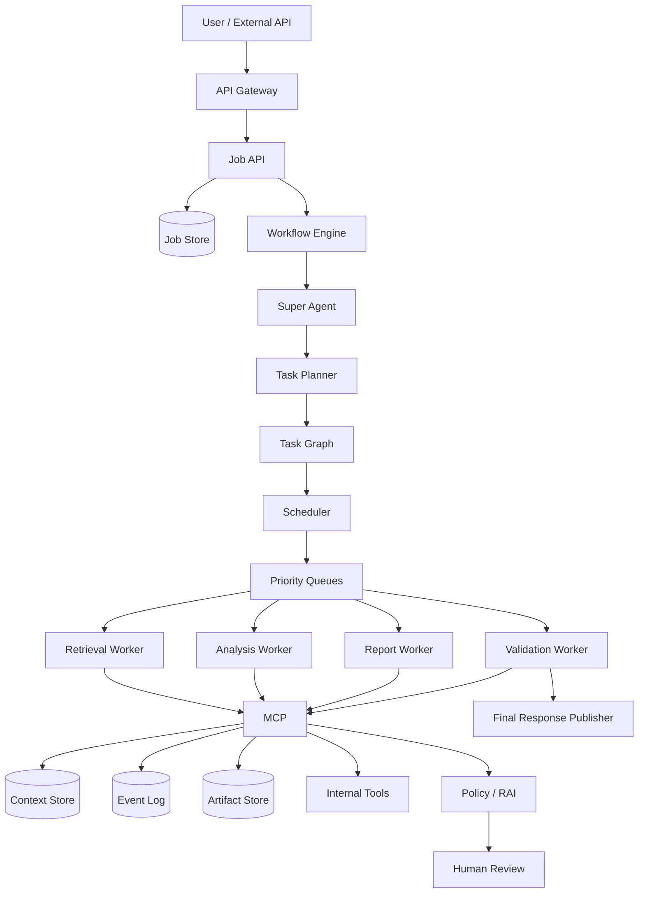
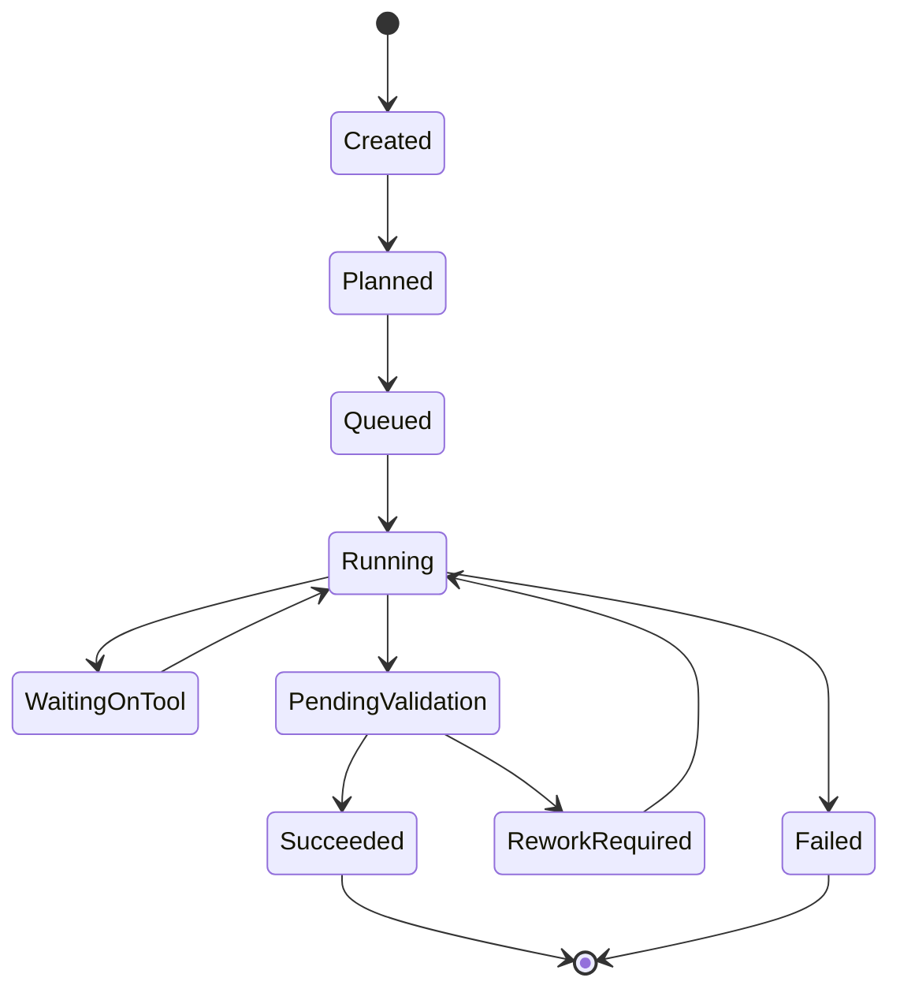

# Scenario 1: End-to-End Long-Running Multi-Agent Job Lifecycle

## Importance rank
**1 / 10** — this is the foundation. Every other scenario depends on this flow working well.

## Why this scenario matters

This platform is valuable only if it survives **real production behavior**:
- jobs that run for a long time
- tools that fail
- partial results
- changing constraints
- governance checks
- concurrency spikes
- budget limits
- human review paths

The design below assumes a **deterministic control plane** with an **LLM-driven planning loop**, **queue-based workers**, **durable state**, and **policy enforcement through MCP**.

## Scenario
A user submits a high-value analytical request:
> "Collect enterprise metrics, retrieve supporting documents, analyze anomalies, generate a report, and route for validation."

This becomes a **long-running, stateful job** with:
- multiple subtasks
- different specialist agents
- tool usage
- intermediate artifacts
- validation before release

## End-to-end architecture



## Detailed execution flow

1. **Job API** creates `job_id`, tenant metadata, policy bundle, and budget.
2. **Workflow Engine** moves the job from `Created` to `Planned`.
3. **Super Agent** converts the objective into a structured task graph.
4. **Scheduler** enqueues ready tasks based on dependencies and priority.
5. **Workers** fetch context only through **MCP**.
6. **MCP** shapes context, authorizes tools, traces calls, and normalizes results.
7. Outputs become **artifacts** and **events**.
8. Final validation checks groundedness, safety, and output completeness.
9. The job is either **released**, **reworked**, or **escalated**.

## State machine



## Important code sample: job and task contracts

```python
from dataclasses import dataclass, field
from typing import List, Optional, Dict

@dataclass
class Task:
    task_id: str
    job_id: str
    agent_type: str
    task_type: str
    depends_on: List[str] = field(default_factory=list)
    priority: str = "normal"
    status: str = "queued"
    attempt: int = 0
    max_attempts: int = 3
    timeout_seconds: int = 300
    policy_bundle_id: str = ""
    input_ref: Optional[str] = None
    output_ref: Optional[str] = None
    cost_budget: float = 0.50

@dataclass
class Job:
    job_id: str
    tenant_id: str
    objective: str
    status: str = "created"
    tasks: List[Task] = field(default_factory=list)
    metadata: Dict[str, str] = field(default_factory=dict)
```

## Important code sample: planner output

```python
def build_initial_plan(objective: str) -> list[dict]:
    return [
        {
            "task_type": "retrieve_sources",
            "agent_type": "retrieval-agent",
            "expected_output": "ranked_evidence_bundle",
            "allowed_tools": ["search_docs", "query_metrics_api"],
        },
        {
            "task_type": "analyze_evidence",
            "agent_type": "analysis-agent",
            "expected_output": "analysis_summary",
            "allowed_tools": ["python_executor"],
        },
        {
            "task_type": "draft_report",
            "agent_type": "report-agent",
            "expected_output": "report_draft",
            "allowed_tools": ["template_renderer"],
        },
        {
            "task_type": "validate_output",
            "agent_type": "validation-agent",
            "expected_output": "release_decision",
            "allowed_tools": ["grounding_validator", "pii_checker"],
        },
    ]
```

## Architecture decisions

### 1. Deterministic workflow outside, adaptive planning inside
**Why**
- lifecycle, retries, and audit need predictability
- planning benefits from LLM flexibility

**Trade-off**
- more moving parts than a single-agent flow
- but much better recovery and governance

### 2. Task graph instead of linear chain
**Why**
- lets retrieval and side analyses run in parallel
- easier to isolate partial failures

**Trade-off**
- dependency management becomes harder
- needs a scheduler with readiness checks

### 3. MCP as the only tool gateway
**Why**
- one enforcement point for auth, policy, audit, and normalization

**Trade-off**
- adds latency hop
- but prevents direct uncontrolled tool access

## Tech stack options and trade-offs

| Layer | Option A | Option B | Trade-off |
|---|---|---|---|
| Workflow | Temporal | Step Functions / Durable Functions | Temporal is flexible for custom orchestration; cloud-native workflows reduce ops burden |
| Queue | SQS / Service Bus | Kafka | SQS is simpler for task queues; Kafka is stronger for high-volume event streaming |
| State store | DynamoDB / Cosmos DB | Postgres | NoSQL scales better for job/task metadata; SQL gives stronger relational querying |
| Artifact store | S3 / Blob | Postgres large objects | Object storage is cheaper and better for large artifacts |
| Vector store | OpenSearch | pgvector / Pinecone | OpenSearch helps hybrid retrieval; dedicated vector DB may simplify tuning |

## Challenges faced and how I would explain overcoming them

### Challenge: the initial planner created vague tasks
**Problem**
The planner returned steps like "analyze everything" or "check documents", which are too broad for reliable workers.

**How I found it**
- unstable output schemas
- high token usage
- repeated re-planning

**Workaround**
- required the planner to emit:
  - task type
  - expected output contract
  - allowed tools
  - stop condition
- rejected plans that exceeded fan-out thresholds

### Challenge: tasks needed information from previous tasks without huge context
**Problem**
Passing full history to every worker made execution expensive and noisy.

**How I overcame it**
- created a **context shaping** layer in MCP
- each worker received:
  - task-specific snapshot
  - latest relevant artifacts
  - compact event summary
  - tenant and policy scope

### Challenge: final output looked correct but was weakly grounded
**Problem**
The report agent could produce polished text that was not tied enough to source evidence.

**How I overcame it**
- validation worker checked source-to-claim traceability
- report generator required evidence references by section
- fallback path returned "insufficient evidence" instead of guessing

## Key architecture decisions

1. Keep the **control plane deterministic** so retries, state transitions, audit, and resume stay reliable.
2. Keep the **execution plane asynchronous** so the worker layer scales independently.
3. Route **all tool access through MCP** so context, governance, and tracing are consistent.
4. Persist **events, checkpoints, and artifacts** separately so observability and recovery do not depend on in-memory state.
5. Treat **budget, policy, and tenant scope** as first-class execution constraints.

## Common roadblocks I would expect in implementation

### Roadblock 1: the planner creates unstable or overly broad tasks
**How I found it**
- too many tasks per job
- repeated replans
- large context windows with low task quality

**How I overcame it**
- forced structured plan schema
- added stop conditions, allowed tools, and output contracts
- introduced max fan-out and max recursion depth

### Roadblock 2: workers behave differently across tool results
**How I found it**
- inconsistent artifact schemas
- retries succeeding only for some tenants
- fragile parsing logic

**How I overcame it**
- normalized tool responses at MCP
- introduced typed result envelopes
- added contract tests per tool adapter

### Roadblock 3: observability is noisy but not actionable
**How I found it**
- many logs, but weak root-cause visibility
- hard to explain why a job stalled

**How I overcame it**
- event model per task state transition
- correlation IDs for job/task/tool/model
- dashboard slices by tenant, tool, agent, and failure category

## Metrics to track
- **job success rate**
- **task retry rate**
- **mean time to recover**
- **human escalation rate**
- **policy denial rate**
- **cost per job**
- **p95 task latency**
- **queue depth and task age**

## Interview-ready summary
This scenario shows the difference between a **demo multi-agent system** and a **production orchestration platform**: the production version is driven by **durable state**, **governed tools**, **clear failure handling**, **observability**, and **well-defined trade-offs**.
