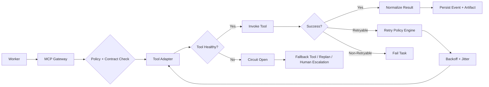

# Scenario 2: Tool Failures, Retries, and Circuit Breakers

## Importance rank
**2 / 10** — in production, tools fail far more often than demos reveal.

## Why this scenario matters

The platform depends on many moving parts:
- APIs
- model endpoints
- parsers
- search indexes
- internal services

Tool resilience determines whether jobs succeed gracefully or collapse under transient failures.

## Scenario
A worker needs to call external tools:
- search service
- metrics API
- SQL runner
- document parser
- model endpoint

Some calls fail due to:
- rate limits
- network timeouts
- partial response corruption
- temporary downstream incidents

## Failure-handling architecture



## Retry policy design

### Retryable
- network timeout
- transient 5xx
- rate limit
- model warm-up delay

### Non-retryable
- policy denied
- invalid parameters
- unsupported capability
- repeated identical failure
- budget exhaustion

## Important code sample: retry policy engine

```python
import random
from dataclasses import dataclass

@dataclass
class RetryDecision:
    should_retry: bool
    backoff_seconds: float
    reason: str

def get_retry_decision(error_type: str, attempt: int, max_attempts: int) -> RetryDecision:
    retryable = {"timeout", "rate_limit", "temporary_5xx", "endpoint_unavailable"}
    if error_type not in retryable:
        return RetryDecision(False, 0, "non_retryable_error")
    if attempt >= max_attempts:
        return RetryDecision(False, 0, "retry_budget_exhausted")
    base = min(2 ** attempt, 30)
    jitter = random.uniform(0, 0.5 * base)
    return RetryDecision(True, base + jitter, "transient_error")
```

## Important code sample: circuit breaker wrapper

```python
class CircuitBreaker:
    def __init__(self, failure_threshold=5, reset_after_seconds=60):
        self.failure_threshold = failure_threshold
        self.reset_after_seconds = reset_after_seconds
        self.failure_count = 0
        self.state = "closed"

    def before_call(self):
        if self.state == "open":
            raise RuntimeError("circuit_open")

    def record_success(self):
        self.failure_count = 0
        self.state = "closed"

    def record_failure(self):
        self.failure_count += 1
        if self.failure_count >= self.failure_threshold:
            self.state = "open"
```

## Architecture decisions
- centralize retries in the control plane
- normalize all downstream failures into platform error types
- use circuit breakers to protect workers and queues

## Challenges faced and workarounds
- **Invalid payloads retried repeatedly** → added pre-call contract validation
- **Dependency outage caused queue buildup** → opened circuit and paused new tasks needing that tool
- **Partial success responses** → introduced typed result envelopes with warnings and recoverability

## Metrics to track
- task retry rate
- fallback activation rate
- tool success rate
- p95 invocation latency
- queue depth by blocked dependency

## Interview-ready summary
This scenario shows how production agent platforms stay stable by treating tools as unreliable dependencies and by combining retries, circuit breakers, fallback planning, and strong observability.
