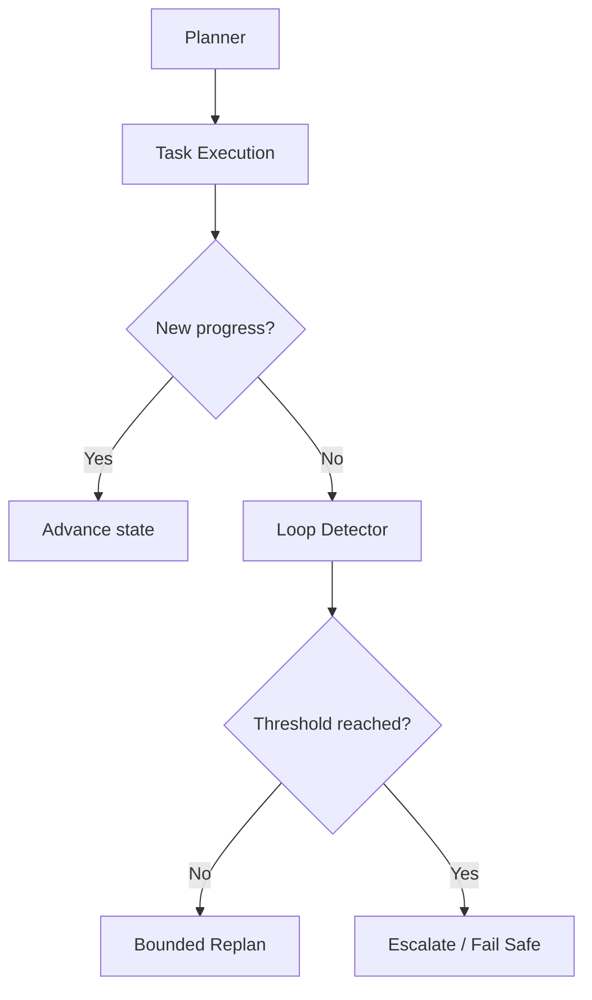

# Scenario 3: Loop Detection and No-Progress Recovery

## Importance rank
**3 / 10** — without loop protection, agent systems waste budget and never finish.

## Scenario
A planner keeps reissuing similar subtasks because evidence is weak, tool output is noisy, or the stopping rule is unclear.

## Diagram


## Key design decisions
- track semantic similarity between recent plans
- define progress using artifact delta, evidence gain, and state advancement
- cap recursion depth and replan count

## Code sample
```python
def should_stop(replan_count: int, similarity_score: float, progress_delta: float) -> bool:
    if replan_count >= 3:
        return True
    if similarity_score > 0.92 and progress_delta < 0.05:
        return True
    return False
```

## Challenges and workarounds
- **Planner kept asking the same question** → added similarity checks on recent plans
- **Partial updates looked like progress** → required artifact-level delta thresholds
- **Jobs burned budget without value** → attached budget ceilings to replan loops

## Trade-offs
- aggressive stopping reduces waste but may miss recovery opportunities
- lenient stopping improves completeness but can explode cost

## Metrics
- replans per job
- no-progress termination rate
- budget wasted on repeated tasks
- mean recovery after bounded replan
