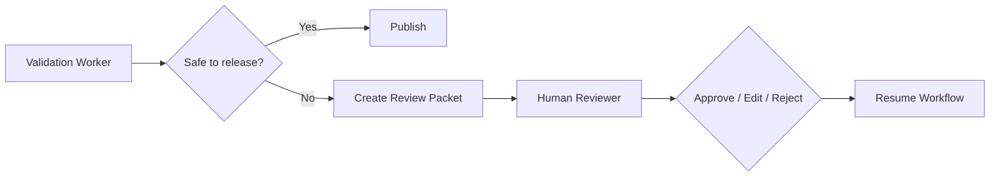

# Scenario 4: Human-in-the-Loop Escalation

## Importance rank
**4 / 10** — some decisions should stop at the human boundary.

## Scenario
The platform reaches a policy-sensitive step: weak evidence, conflicting results, or a compliance risk.

## Diagram


## Design decisions
- escalate only with a compact review packet, not raw logs
- preserve reviewer decisions as first-class events
- allow resume from checkpoint after review

## Code sample
```python
def escalation_needed(grounded: bool, pii_flag: bool, confidence: float) -> bool:
    return (not grounded) or pii_flag or confidence < 0.7
```

## Challenges and workarounds
- **Reviewers got too much noise** → created concise evidence bundles and decision summaries
- **Edits were lost after resume** → stored reviewer edits as protected artifacts
- **Escalation volume grew** → tuned thresholds and added better automated validation

## Trade-offs
- more escalation improves safety but increases latency
- less escalation improves speed but raises business risk

## Metrics
- escalation rate
- reviewer turnaround time
- post-review override rate
- publish-after-review success rate
