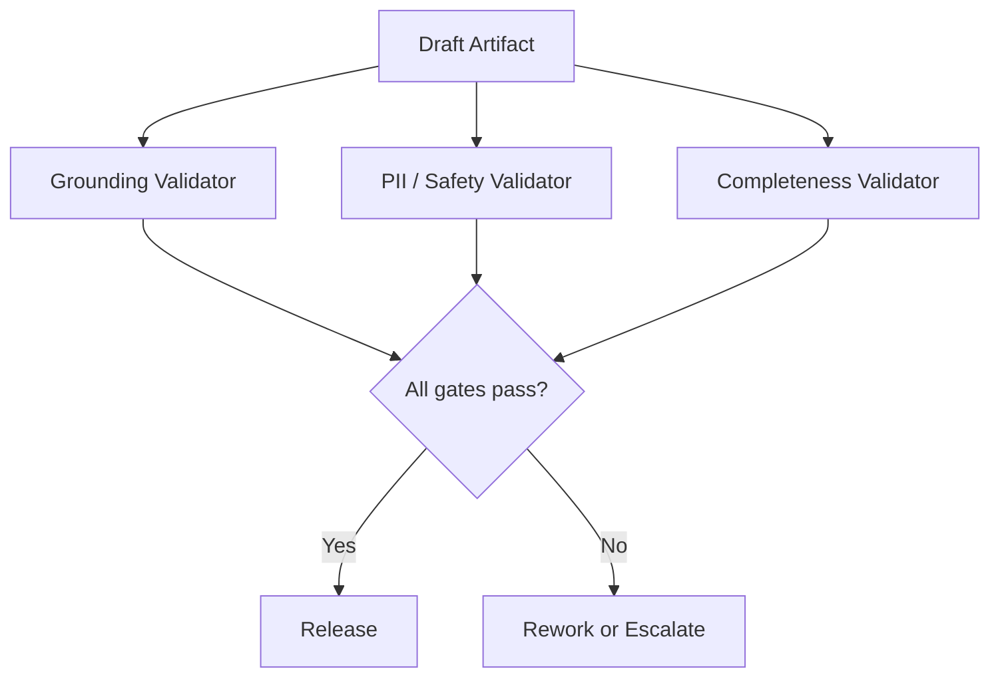

# Scenario 5: Responsible AI Validation and Release Gates

## Importance rank
**5 / 10** — the system must prove outputs are safe and grounded before release.

## Scenario
A report draft is complete, but it must pass grounding, PII, policy, and completeness checks.

## Diagram


## Design decisions
- validation runs as a separate worker, not inside generation
- source-to-claim traceability is required for high-value outputs
- policy bundles are tenant-aware and versioned

## Code sample
```python
def release_allowed(grounding_score: float, pii_found: bool, completeness_score: float) -> bool:
    return grounding_score >= 0.85 and not pii_found and completeness_score >= 0.9
```

## Challenges and workarounds
- **Well-written but weakly grounded output** → required claim-to-source references
- **Policy rules differed by tenant** → attached versioned policy bundles at job creation
- **Validation slowed throughput** → parallelized independent validators

## Trade-offs
- stronger gating reduces risk but increases latency
- lighter gating improves speed but risks unsafe release

## Metrics
- release gate pass rate
- rework rate
- false positive validator rate
- unsafe output escape rate
