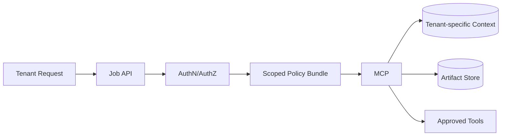

# Scenario 6: Multi-Tenant Isolation and Security Boundaries

## Importance rank
**6 / 10** — shared platforms fail fast if tenant boundaries are weak.

## Scenario
Multiple tenants run jobs concurrently with different data scopes, policies, and tool permissions.

## Diagram


## Design decisions
- tenant scope is attached to every job, task, artifact, and event
- MCP is the single enforcement point for data and tool access
- secrets and credentials are isolated by tenant boundary

## Code sample
```python
def authorize_tool_call(request_tenant: str, resource_tenant: str, allowed: list[str], tool: str) -> bool:
    return request_tenant == resource_tenant and tool in allowed
```

## Challenges and workarounds
- **Cross-tenant data leakage risk** → enforced tenant IDs at storage and retrieval layers
- **Shared caches mixed results** → used tenant-aware cache keys
- **Different compliance needs** → versioned per-tenant policy bundles

## Trade-offs
- stronger isolation adds complexity and some latency
- weak isolation simplifies design but is unacceptable for enterprise systems

## Metrics
- policy denial rate
- cross-tenant access violations
- tenant-scoped cache hit rate
- secrets rotation success rate
