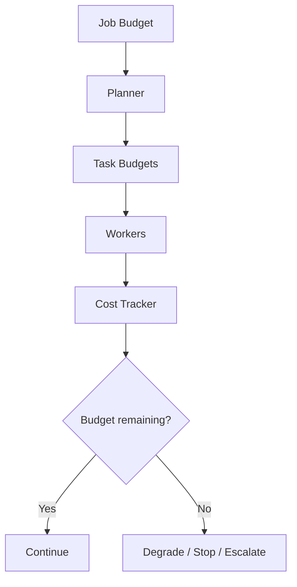

# Scenario 7: Cost-Aware Planning and Budget Controls

## Importance rank
**7 / 10** — without budget controls, multi-agent systems become expensive very quickly.

## Scenario
A job can fan out across retrieval, analysis, validation, and report generation. Each task consumes tokens, compute, and tool costs.

## Diagram


## Design decisions
- allocate a budget at job creation and subdivide per task
- choose cheaper models for low-risk steps
- stop low-value replans when marginal gain is weak

## Code sample
```python
def can_continue(spent: float, budget: float, expected_next_cost: float) -> bool:
    return spent + expected_next_cost <= budget
```

## Challenges and workarounds
- **planner chose expensive paths by default** → introduced cost-aware ranking for candidate plans
- **long jobs exceeded budget late** → reserved budget for validation and finalization upfront
- **cost observability was poor** → tracked spend by job, task, tool, and model

## Trade-offs
- aggressive budgeting reduces waste but may cut completeness
- flexible budgeting improves answer quality but increases spend risk

## Metrics
- cost per job
- cost per successful job
- budget exhaustion rate
- average cost by agent type
