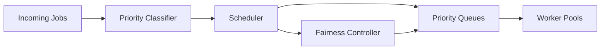

# Scenario 8: Scale, Burst Handling, and Scheduler Fairness

## Importance rank
**8 / 10** — bursty workloads expose queueing and starvation problems quickly.

## Scenario
Many tenants submit long-running jobs at the same time. Some are urgent, some are large, and some depend on scarce tools.

## Diagram


## Design decisions
- separate queues by priority and capability
- fairness controller prevents one tenant from starving others
- admission control protects scarce downstream tools

## Code sample
```python
def pick_next(queue_items):
    return sorted(queue_items, key=lambda x: (x.priority_score, -x.wait_time), reverse=True)[0]
```

## Challenges and workarounds
- **one tenant flooded the system** → enforced tenant quotas and concurrency caps
- **low-priority jobs never ran** → added aging so wait time boosts priority gradually
- **hot partitions in queue storage** → sharded queue keys and worker leases

## Trade-offs
- strict fairness can reduce raw throughput
- priority-heavy scheduling improves SLA for urgent work but can starve background jobs without aging

## Metrics
- queue depth
- task age
- worker utilization
- tenant fairness score
- SLA miss rate
