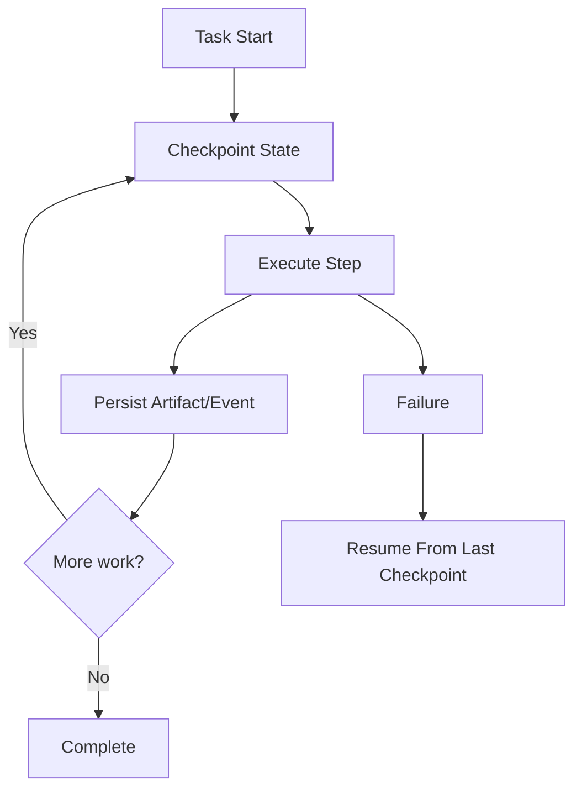

# Scenario 9: Checkpointing, Resume, and Disaster Recovery

## Importance rank
**9 / 10** — long-running jobs need durable recovery, not restart-from-zero behavior.

## Scenario
A worker crashes mid-execution, a queue lease expires, or a regional dependency goes down.

## Diagram


## Design decisions
- persist checkpoints at safe boundaries, not every token
- separate task leases from durable job state
- resume from the last durable artifact and event position

## Code sample
```python
def resume_point(events: list[dict]) -> str:
    completed = [e for e in events if e.get("type") == "checkpoint_saved"]
    return completed[-1]["checkpoint_id"] if completed else "start"
```

## Challenges and workarounds
- **duplicate execution after retry** → made tool calls idempotent where possible
- **large checkpoints became expensive** → stored compact state plus artifact references
- **regional outage hit one dependency** → degraded to fallback tools and paused affected task classes

## Trade-offs
- frequent checkpointing improves recovery but increases overhead
- infrequent checkpointing reduces storage cost but increases replay time

## Metrics
- mean time to recover
- replay cost after failure
- duplicate side-effect rate
- checkpoint size and frequency
