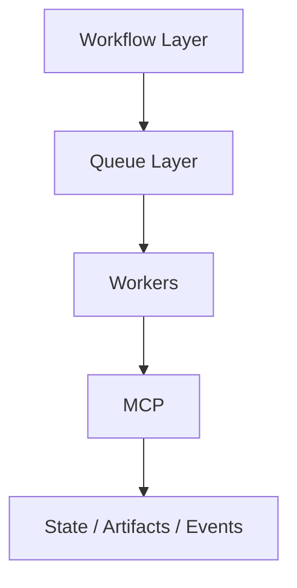

# Scenario 10: Tech Stack Choices and Platform Trade-offs

## Importance rank
**10 / 10** — platform quality depends on picking the right operating model, not just the right frameworks.

## Decision areas
- workflow engine
- queueing and eventing
- state store
- artifact store
- vector and search layer
- observability and policy enforcement

## Architecture comparison


## Example trade-off table
| Layer | Choice A | Choice B | Trade-off |
|---|---|---|---|
| Workflow | Temporal | Step Functions | Temporal is flexible and code-centric; Step Functions reduces ops burden |
| Queue | SQS / Service Bus | Kafka | Queues are simpler for task dispatch; Kafka is stronger for high-volume event streams |
| State store | DynamoDB / Cosmos DB | Postgres | NoSQL scales well for job metadata; SQL is better for relational queries |
| Artifact store | S3 / Blob | Database BLOBs | Object storage is cheaper and better for large outputs |
| Retrieval | OpenSearch | pgvector / Pinecone | OpenSearch supports hybrid retrieval well; specialized vector stores may simplify tuning |

## Code sample
```python
def select_workflow(needs_custom_recovery: bool, ops_team_size: str) -> str:
    if needs_custom_recovery and ops_team_size != "small":
        return "temporal"
    return "managed_workflow"
```

## Challenges and workarounds
- **too many platform components increased ops load** → standardized interfaces and reduced direct coupling
- **single data store tried to do everything** → separated job state, artifacts, and events by access pattern
- **tool governance was inconsistent** → moved enforcement into MCP as a single gateway

## Interview-ready summary
The best stack is the one that matches recovery needs, operator skill, governance requirements, and cost profile. For production multi-agent platforms, durable orchestration, explicit state, governed tool access, and strong observability matter more than trendy framework choices.
